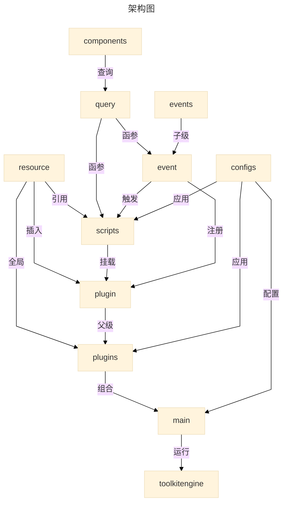

```mermaid
---
title: 架构图
config:
  theme: base   
  markdownAutoWrap: false
  flowchart:
   curve: linear
---
graph TD
    resource --> |全局|plugins --> |组合|main --> |运行|toolkitengine
    resource --> |插入|plugin --> |父级|plugins
    resource --> |引用|scripts --> |挂载|plugin
    components --> |查询|query --> |函参|event & scripts
    event --> |注册|plugin
    event --> |触发|scripts
    events --> |子级|event
    configs --> |配置|main
    configs --> |应用|plugins & scripts   
```