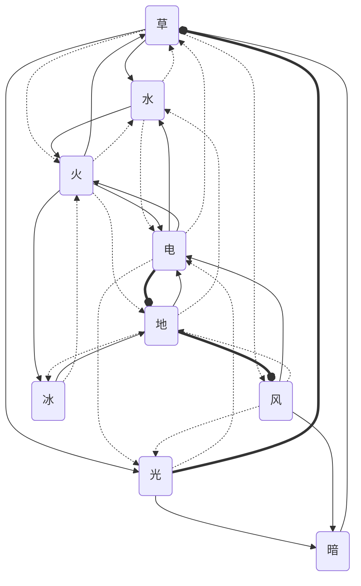

```
图例:
  -->   克制 2.0 (进攻端)
  -.->  微弱 0.5 (攻击方乏力，防守端占优)
  ==o   免疫 0.0 (攻击无效)

==== 各属性防守端 ====

草  被克: 火 暗        抵抗: 水 电        免疫: 光
水  被克: 草 电        抵抗: 火 地        免疫: —
火  被克: 水 电        抵抗: 草 冰        免疫: —
电  被克: 火 地 风     抵抗: 水           免疫: —
光  被克: 草           抵抗: 风 电        免疫: 暗(光→暗=2.0, 暗→光=1.0, 暗微弱于光)
暗  被克: 光 风        抵抗: —           免疫: —
冰  被克: 火           抵抗: 地           免疫: —
地  被克: 冰           抵抗: 火 风        免疫: 电
风  被克: —            抵抗: 草           免疫: 地
```